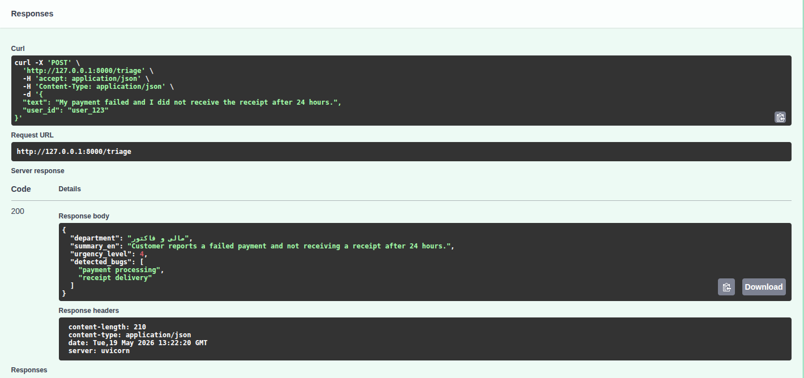

# Support Triaging Engine

A production-oriented microservice for analyzing and triaging customer support tickets using LLM orchestration, semantic caching, and structured output validation.

The service is designed to improve response consistency, reduce unnecessary LLM calls, and remain resilient in the presence of provider failures, malformed model outputs, or cache errors.

---
## Table of Contents

- [Overview](#overview)
- [Key Features](#key-features)
- [Documentation](#documentation)
- [Architecture Summary](#architecture-summary)
- [Tools and Technology Choices](#tools-and-technology-choices)
- [Exception Handling Strategy](#exception-handling-strategy)
- [Semantic Caching Strategy](#semantic-caching-strategy)
- [Local Development](#local-development)
- [Project Structure](#project-structure)
- [vLLM Deployment Considerations for Internal Infrastructure](#vllm-deployment-considerations-for-internal-infrastructure)
- [Design Priorities](#design-priorities)
- [Future Improvements](#future-improvements)
- [Repository Documentation](#repository-documentation)
- [Example Output](#example-output)
---

## Overview

This project processes incoming support tickets through a multi-stage pipeline:

1. **Context optimization** to clean and optionally compress the raw ticket text
2. **Semantic cache lookup** to reuse previous analyses for similar tickets
3. **LLM orchestration** for classification and summarization on cache miss
4. **Output validation** to guarantee structured responses
5. **Cache insertion** so future similar tickets can bypass the LLM

The overall design focuses on:

- **reliability**
- **low latency**
- **cost efficiency**
- **production safety**
- **clear operational behavior under failure**

---

## Key Features

- **FastAPI-based microservice**
- **LLM orchestration with retry handling**
- **Structured output validation using Pydantic**
- **Semantic caching using embeddings + similarity threshold**
- **Graceful fallback behavior for LLM failures**
- **Logging to both console and file**
- **Deployment-ready design for local or internal GPU infrastructure**

---

## Documentation

Detailed documentation is available in the [`docs/`](./docs) directory:

- [Architecture](./docs/architecture.md)
- [Installation](./docs/installation.md)
- [Project Layout](./docs/layout.md)
- [Caching Strategy](./docs/caching_strategy.md)
- [vLLM Deployment Notes](./docs/vllm_deployment.md)

---

## Architecture Summary

The service follows a staged processing flow:

1. **Raw ticket intake**
2. **Context optimization**
3. **Semantic cache lookup**
4. **LLM orchestration on cache miss**
5. **Validation and response generation**
6. **Cache insertion for future reuse**

At a high level:

- The **context optimizer** removes unnecessary noise and prepares ticket text
- The **semantic cache** avoids repeated LLM calls for similar requests
- The **orchestrator** manages prompt execution, retries, validation, and fallback logic
- The **LLM client** isolates provider-specific communication concerns
- The **API layer** exposes the service through FastAPI

For the full pipeline and flow diagram, see [Architecture](./docs/architecture.md).

---

## Tools and Technology Choices

This implementation uses the following tools and libraries:

- **FastAPI** for the HTTP API layer
- **Pydantic** for schema validation and structured outputs
- **Sentence Transformers** for semantic embeddings
- **FAISS** for vector similarity search
- **Requests** for LLM provider communication
- **Python logging** for observability and troubleshooting

### Why these choices

- **FastAPI** provides a clean, lightweight, and production-friendly API framework
- **Pydantic** ensures the LLM output conforms to a predictable schema
- **Sentence Transformers + FAISS** enable efficient semantic caching
- **A dedicated orchestrator layer** keeps retry, validation, and fallback logic centralized
- **Custom exception types** make failure modes explicit and easier to handle correctly

### Why not use LangChain or LlamaIndex

Frameworks such as **LangChain** and **LlamaIndex** provide powerful abstractions for building complex LLM applications. However, for this service they were intentionally not used.

Reasons include:

- **Simplicity** – the required pipeline (prompt → LLM → validation → caching) is relatively small and does not require a large orchestration framework.
- **Transparency** – implementing the orchestration logic directly keeps request flow, retries, and error handling fully visible and easier to reason about.
- **Reduced dependency complexity** – avoiding heavy frameworks minimizes dependency size and upgrade friction.
- **Operational control** – direct integration with the LLM provider allows precise control over retries, error handling, and request structure.

For larger systems involving agents, multi-step chains, or complex retrieval pipelines, frameworks like LangChain or LlamaIndex could be appropriate. In this case, a **lightweight custom orchestration layer** was considered more maintainable and easier to operate.

---

## Exception Handling Strategy

One of the main design goals of this project is to ensure the service behaves safely even when external dependencies fail.

### 1. LLM connection and service failures

Failures such as:

- request timeouts
- connection errors
- rate limiting
- invalid HTTP responses
- missing or empty provider output

are normalized inside the LLM client and raised as **`LLMServiceError`**.

This ensures the rest of the system does not need to understand provider-specific failure modes.

### 2. Invalid LLM output

Even if the LLM responds successfully, the output may still be unusable:

- malformed JSON
- missing fields
- schema mismatch
- null or incomplete content

These cases are handled in the orchestrator through:

- JSON parsing checks
- Pydantic validation
- retry attempts
- final fallback behavior

If retries are exhausted, the system raises or converts the issue into a safe application-level failure such as **`OutputValidationError`**, or returns a predefined fallback response depending on the execution path.

### 3. Cache failures

Cache lookup and cache insert operations are wrapped in defensive `try...except` blocks so cache-related issues do not crash the service.

This means:

- cache failure does **not** prevent ticket processing
- the service can still continue with direct LLM execution
- cache storage failure does **not** block the final response

### 4. Graceful degradation

The orchestrator is designed so that transient LLM failures or malformed outputs do not immediately cause a 500-level crash.

Instead, the service applies:

- retries for recoverable failures
- validation before trusting model output
- fallback behavior when all retry attempts fail

If the LLM fails after all retry attempts, the system returns a predefined safe `TicketAnalysis` response indicating that the ticket could not be automatically processed. This ensures the API still returns a valid structured response rather than failing the request.

This keeps the microservice predictable and production-safe.

---

## Semantic Caching Strategy

To reduce repeated LLM calls, the service uses semantic caching.

### How it works

- The incoming ticket is converted into an embedding
- The embedding is compared with cached embeddings using cosine similarity
- If similarity is above the configured threshold, the cached analysis is reused
- Otherwise, the ticket is sent to the LLM and the result is stored for future requests

### Embedding model

The project uses:

`sentence-transformers/all-MiniLM-L6-v2`

This model is a practical choice for short support-ticket text because it is:

- fast
- lightweight
- suitable for sentence similarity tasks
- efficient for real-time cache lookup

### Similarity threshold

A default threshold of **0.85** is used.

This offers a practical trade-off between:

- avoiding false positives
- getting meaningful cache hit rates
- reducing latency and inference cost

For more detail, see [Caching Strategy](./docs/caching_strategy.md).

---

## Local Development

For local setup instructions, see [Installation Guide](./docs/installation.md).

In short, the standard workflow is:

1. Copy `.env.example` to `.env`
2. Create a virtual environment
3. Install dependencies
4. Run the local startup script

---

## Project Structure

For the full repository layout, see [Project Layout](./docs/layout.md).

Main components:

- `src/api/` — FastAPI application entrypoint
- `src/core/` — configuration, logging, exceptions
- `src/models/` — response schemas
- `src/services/` — business logic, LLM integration, cache, orchestration
- `src/prompts/` — prompt templates
- `docs/` — architecture and operational documentation

---

## vLLM Deployment Considerations for Internal Infrastructure

If this microservice were to be deployed on internal GPU servers using **vLLM**, the most important throughput-related configuration decisions would be the following:

### 1. `tensor_parallel_size`

This should match the deployment strategy and hardware topology.

- For **heterogeneous GPUs** such as an **A100 + H200**, it is generally better to run **two separate vLLM instances**
- In that case, each instance should use:
```python
tensor_parallel_size = 1
```
Using tensor parallelism across mismatched GPUs usually reduces efficiency because the faster GPU is forced to wait for the slower one.

---

### 2. `max_model_len`

This setting strongly affects KV‑cache memory usage and therefore overall concurrency.

For short ticket‑classification workloads, large context windows are unnecessary. Reducing this value allows more requests to be processed simultaneously, improving throughput.

Typical practical values:

- `2048` for strict efficiency  
- `4096` if additional context space is required  

For this use case, lowering `max_model_len` is one of the most impactful optimizations.

---

### 3. Batch and Concurrency Tuning

To maximize throughput, the system should tune parameters such as:

- maximum concurrent sequences
- request batching behavior
- KV‑cache precision

Because support tickets are typically short, the system can sustain higher batching levels without significantly increasing latency.

---

### 4. Model Sizing

For high‑throughput workloads, a **small‑to‑medium sized model** is usually the most practical choice.

Typical examples include:

- **7B models**
- **8B models**

These models are generally sufficient for structured tasks such as ticket triaging while allowing higher concurrency and lower latency compared to larger models.

---

### 5. Separate Serving by GPU Capability

Since the **H200** has significantly greater memory capacity and compute throughput than the **A100**, it is generally better to run them as separate serving instances.

Recommended approach:

- serve each GPU independently
- tune concurrency parameters separately
- route traffic based on utilization or queue depth

This typically provides better total throughput than forcing heterogeneous GPUs into a shared tensor‑parallel deployment.

For more details, see **[vLLM Deployment Notes](./docs/vllm_deployment.md)**.

---

## Future Improvements

Possible future enhancements include:

- stronger observability with metrics and tracing
- model‑specific prompt optimization
- configurable fallback policies
- offline evaluation for similarity threshold tuning

---

## Example Output

Below is a sample output generated by the service for a triaged support ticket.



This example illustrates the structured response produced by the system after processing a ticket through the full pipeline, including context optimization, semantic cache lookup, LLM inference (if required), and schema validation.